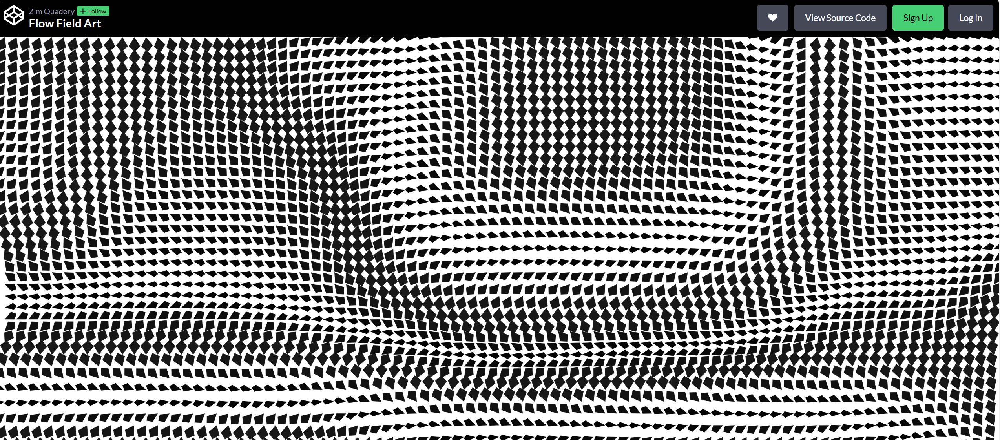
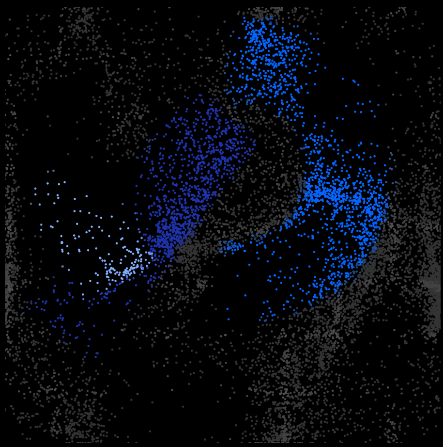

# Wheels of Fortune: Perlin-Noise Flowfield Variation

### Individual Submission – IDEA9105 p5.js Project
**Author:** Tianze Rong  
**Artwork Reference:** Pacita Abad – Wheels of Fortune (2000)

---

## 1. Overview

This project recreates and reinterprets Pacita Abad’s Wheel of Fortune using p5.js, focusing on layered circular motifs, vibrant palettes, and rhythmic motion.  
The group code generates a full-screen grid of animated “wheels” featuring dots, rays, breathing (pulsing), and rotating patterns.

My individual work extends this with a Perlin-noise-driven particle flowfield that moves around the wheels, creating colourful trails influenced by palettes of nearby wheels. It is also an implementation of the dot pattern between the wheels of the orignal art work.
The result is a dynamic composition in which Abad’s wheels sit within a swirling, living environment.

---

## 2. How to Interact With the Work

Once the sketch is loaded:

### Perlin Noise Particle Field (my individual work)
- **↑ / ↓** — increase or decrease particle movement speed  
- **← / →** — thin or thicken the particle trail lines  
- Reloading the page to randomly reset the pattern and color of the wheels.

---

## 3. My Individual Animation Approach

### Chosen Animation Method: Perlin Noise + Randomness
I chose to drive my animation using:

- Perlin noise (for smooth, directional flow)
- Random values & randomised seeding (for variation in particle behaviour)

This combination creates motion that feels:
- organic rather than mechanical  
- unpredictable but not chaotic  

### What I Animate
My animation adds a completely new system independent from the wheels:

- Thousands of Perlin-noise-driven particles  
- Smooth flow field derived from 3D noise (x, y, z)  
- Particles detect wheels and curve around them (obstacle avoidance)  
- Particles borrow colour palettes from the closest wheel  
- Trails fade slowly to build layered visual texture  
- Randomised spawn zones for variation  


---

## 4. Inspiration & References

### Visual Inspiration
1. Pacita Abad’s original Wheel of Fortune painting  
2. Perlin-noise flowfield artworks 

[](https://codepen.io/zimquadery/full/VwoeRGW)  

*Figure 1: Perlin Noise Field Visual Example* 

[](https://openprocessing.org/sketch/1247705/)  

*Figure 2: Perlin Noise Field Visual Example*  

These influenced me to create a system that feels alive and self-organising.

---

## 5. Technical Explanation of My Animation

### 5.1 Perlin Noise Field
Each particle's movement is guided by a perlin noise driven vector:

```
let n = noise(this.pos.x * noiseScale, this.pos.y * noiseScale, noiseZ);
let baseAngle = n * TWO_PI * 4.0;
let vel = p5.Vector.fromAngle(baseAngle).mult(this.speed);
```

### 5.2 Randomised Particle Behaviour
Particles randomise:
- starting position  
- speed  
- spawn region  

### 5.3 Wheel Detection System
Particles detect the nearest wheel and use:
- radial vector 
```
let radial = createVector(this.pos.x - nearest.x, this.pos.y - nearest.y);
radial.normalize();
``` 
- tangent vector  
```
let tangent = createVector(-radial.y, radial.x).normalize();
```
- blended steering  
```
let steerDir = p5.Vector.lerp(vel.copy().normalize(), tangent, 0.7 + 0.3 * t); // At least 70% tendency to tangent vector
vel = steerDir.mult(this.speed);    // Update the moving direction
```

to glide around the wheels.

### 5.4 Colour Borrowing
Particles detect and pick colours from the nearest wheel palette.


---

## 6. Modifications Made to Group Code

- Added **FlowParticle** class  
- Added **steering & wheel-detection logic**  
- Added **particle colour inheritance**  
- Added **particle trail** that creates the flowing background  

---

## 7. External Tools or Techniques Used

- p5.js `noise()` (course content)  
- p5.js `p5.Vector` and the vector related operations for particles' movements 
- No external libraries  

---

## 8. References

- Abad, Pacita (2000). *Wheels of Fortune*.  
- Figure 1 https://codepen.io/zimquadery/full/VwoeRGW
- Figure 2 https://openprocessing.org/sketch/1247705/

---


